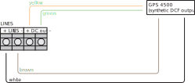

# Non-network clock operation

Configure the position of DIP switch according to the source of synchronization (DCF position if the source is DCF, otherwise do not configure the position for MOBATIME serial code, polarized impulse line, MOBALine or IRIG-B).
Choose the item **o2** in **SYNC** menu and set the type of synchronization. The autodetection mode (**o2: A), when the type of synchronization signal is set automatically, is applicable for DCF signal, MOBATIME serial code, IRIG-B. The permamently lit color during the time display signalizes the clock is synchronized by the synchronization source.

## Autonomous clock synchronized by DCF77 receiver

* Set value **A** in **SYNC** menu items **o1, o2** and in **diSP** menu item **d2**.

* Connect the DCF77 receiver to the clock terminal board placed on the anchoring plate (LINE IN terminals) using twin-wire cable.

* The maximum wire length depends on its diameter (approx. 100-300 m).

* In case of the connection is correct and the input signal is at high level, the LED on the receiver is flashing periodically once a second with one pulse left out at 59^th^ second. 
**If the polarity is incorrect, the LED does not flash. In such case, intercharge the two wires.**

* Install the receiver at a place with a high-level radio signal. Do not install the receiver near sources of interfering signals, such as PCs, TVs or other types of power consumers (the digital clock itself generates intefering signals too).

* Position the receiver with its transparent cover (DCF 450) or the arrow on the cover (DCF 4500) facing the transmitter (located in Frankfurt, Germany). Presuming the good quality DCF77 signal the synchronization takes place in approx. 3-4 minutes. In case of poor quiality of the signal (mainly during day time), the first time setting is to be done manually. The red LED of the receiver displays a working connection by flashing once a second without flickering.

## Autonomous clock synchronized by GPS receiver

* Set values **o2: 10, 21: A** in the **SYNC** menu and the desired time zone in **dISP** menu item **d2**.

* Connect the GPS antenna to SMA connector.

* Presuming the good position of the GPS receiver. The synchronization takesp lace in approx. 10-20 minutes.

## Autonomous clock synchronized by GPS receiver (GPS 4500)

* Set value **A** in **SYNC** menu items **o1, o2** and the desired time zone in **dISP** menu item **d2**.

* Using jumper JP17 set the power supply output (DC OUT) on pins 3, 4 of the JP1 connector.

* Connect GPS receiver (GPS 4500) to the clock PCB (LINE IN and DC OUT terminals) using four-wire cable.
**Please note the correct polarity of the wires - see the GPS user manual.**

* For the correct placing of the receiver please follow the GPS user manual.

* Presuming the good position of the GPS receiver (GPS 4500) the synchronization takes place in approx. 10-20 minutes.

## Slave clock controlled by synchronizing impulses

On digital clock connected in time distribution system controlled by synchronizing impulses choose the item **o2** in the **SYNC** menu and set according type of impulse line (polarized / unpolarized impulses, synchronization and time setting / synchronization only). Set the value **A** in **SYNC** menu item **o1** and in **dISP** menu item **d2**.

### Synchronization and time setting - o3 mode 1 and 3

* Clocks are set according to the slave line time on the Master clock.

* Stop the Slave line on Master clock.

* Set all Slave clocks on same time. Set the current date on the digital clock. The clock stand still and the colon fashes in 2 second interval.

* Set the time of the Slave line to same time as on Slave clocks.

* Run the Slave line on Master clock.

* After receiving each impulse, the displayed time is increased by one minute (or by 30 seconds or 1 second respectively).

* After expiration of run-out time the Slave clocks are synchronized by the time information generated by the Master clock, the colon flashes constantly.

* In case of line fault, the clock displays the right time information based on its own quartz time base. When the normal operation of the line resumes, the Slave clock adjusts itself to the time equeal to the Master clock.

### Synchronozation only - o3 mode 2 and 4

* The clock time-base is synchronized by incoming pulses in normal operation of the Slave line.

* Set current date and time on the Slave clock according the Master clock time with accuracy of +-30 seconds (or +-15 seconds or +-0.5 second respectively).

* The colon flashes in 2 second interval.

* After 2-3 minutes are the clocks synchronized with the Master clock. The colon is permamently lit during the display of time.

* In case of the line fault, the clock displays the right time information based on its own quartz time base. When the normal operation of the line resumes, the clock synchronizes with the incoming pulses.

## Slave clock controlled by MOBATIME serial code, MOBALine or IRIG-B

* After connection of the digital clock to the signal source, time and date are adjusted automatically, following the receipt of calid time information.

* The time setting with using the serial coded line takes place with at lease 3-4 minutes, for MOBALine and IRIG-B within 6-15 seconds.

## Slave clock controlled by IF482 over RS485

* After connection of the digital clock to the line, time and date are adjusted automaticall, following  the receipt of valid time information.

* Setting the tune takes place within at least 5 minutes.

